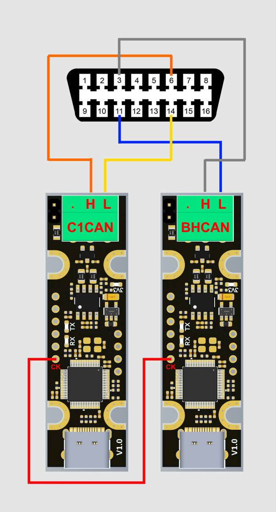

# GiUCAN

## DISCLAIMER

GiUCAN is an experimental project developed solely for educational and research purposes. It is strictly prohibited to use this tool on vehicles operating on public roads or in any manner that may pose a risk to public safety, violate laws or regulations, or cause harm to people or property.

The developer of GiUCAN assumes no liability for any damages, malfunctions, legal issues, or other consequences arising from its use. All responsibility lies with the end user, who assumes full civil, criminal, and legal liability for any misuse.

Do not use this project in real-world vehicle control or autonomous driving applications.

## Rationale

I'm contributing to the [BACCAble](https://github.com/gaucho1978/BACCAble) repository, I'm keeping this one strictly target to my needs; the goal is to use it as a learning playground.
Please check the amazing [BACCAble](https://github.com/gaucho1978/BACCAble) project!

## What you need and how to connect

### Premise

Since MY2018 Giulia and Stelvio are equipped with SGW; if you car has SGW you need a bypass.

### Hardware

GiUCAN has been developed and tested for [FYSETC UCAN](https://github.com/FYSETC/UCAN) so you need:

- 2 FYSETC UCAN boards; from now on we'll refer at them as "BHCAN" and "C1CAN"
- 1 wire to connect BHCAN to C1CAN on CK pin
- 1 OBD2 male connector
- 4 wires to connect OBD2 pins for BH and C1 CanCAN Busses to UCAN boards

### Connection schema



- connect CK pin of the 2 boards
- connect C1CAN CAN_H to OBD2 pin 6 
- connect C1CAN CAN_L to OBD2 pin 14
- connect BHCAN CAN_H to OBD2 pin 3 
- connect BHCAN CAN_L to OBD2 pin 11

Boards must be powered with 5V, you can get the power from the USB connector below the AC; if your ETM has a free USB HSD connector you can use that one to keep the power connection hidden

**DO NOT** connect boards to 12V OBD2 pin with a power converter: OBD2 12V is always providing power even when the car is off and in deep sleep mode, GiUCAN relays on ETM powering off USB for shutdown of boards; **NO LOW CONSUMPTION MODE HAS BEEN IMPLEMENTED.**

## Building

Just run [build.sh](https://github.com/anegrin/GiUCAN/blob/main/build.sh) and it will create 3 elf firmware files under `dist` folder:

- GiUCAN_SLCAN.elf: it's badically the original firmware, flash this if you wanna use the board to sniff CAN Bus (for exaple with [SavvyCAN](https://github.com/collin80/SavvyCAN)); there are plenty of examples online on how to use canable-fw with SavvyCAN
- GiUCAN_BHCAN.elf: firmware for BHCAN board
- GiUCAN_C1CAN.elf: firmware for C1CAN board

By default builds are for Diesel and 7 inch dashboard display

## Flashing

You can use [dfu-util](https://github.com/anegrin/GiUCAN/blob/main/Makefile#L102C7-L102C15) or [STM32CubeProgrammer](https://www.st.com/en/development-tools/stm32cubeprog.html); connect boards via USB in boot mode by short cutting BO and 3V3 pins then flash the firmware you like via DFU (Erasing & Programming -> USB from the dropdown on the left).

## Usage

Once flashed and connected power on your car; after few seconds you'll see the SNS led on the left active and it means that the SNS has been disabled.

To view messages on the dashboard just keep the cruise control RES button pressed for a couple of seconds, keep it pressed again to hide; you can use cruise control speed joystick to move across dashboard items (1 by 1 or 10 by 10 using "hard press").

If ETM need to show something it will stay on the dashboard for a little bit ore than a second, then GiUCAN will display the item again.

If a DPF regeneration is about to start and it's not a "forced" one GiUCAN will fire a sound notification (seat belts alarm) and display the "DPF status" item on the dashboard (even if you haven't enabled messages by long press of RES button).

## Customization

By creating a file named `inc/user_config.h` you can customize almost any feature or behavior of GiUCAN; please do check the content of [inc/config.h](https://github.com/anegrin/GiUCAN/blob/main/inc/config.h) as reference

### Features and behaviors

- `#define DISABLE_EXTERNAL_OSCILLATOR`: UCAN has and external 8Mhz oscillator, GiUCAN use it by default; you can disable it and use internal.
- `#define GIUCAN_VERSION "foo"`: default is `dev` or `commit short hash` but you can provide your own like "foo"
- `#define DISPLAY_INFO_CODE 0x09`: dashboard message icon, default is `0x08` (Center USB); values reference [here](https://github.com/anegrin/GiUCAN/blob/main/inc/config.h#L47-L49)
- `#define DASHBOARD_MESSAGE_MAX_LENGTH 18`: suggested value if you have 3.5 inches dashboard; **MUST BE MULTIPLE of 3**, values greater than 27 are not recommended; there are some considerations to make: GiUCAN is refreshing values twice per second and sending 3 chars to the dashboard every 29ms so a full message takes 29*DASHBOARD_MESSAGE_MAX_LENGTH/3 milliseconds to be rendered
- `#define DISABLE_DASHBOARD_FORCED_REFRESH`: GiUCAN will refresh items only when their values change
- `#define DASHBOARD_FORCED_REFRESH_MS 1000`: if GiUCAN can refresh items even if no values have changed this controls how often to do so, in milliseconds. default is 1.5s
- `#define DISABLE_DPF_REGEN_NOTIFICATIION`: completely disable the DPF regeneration notification feature
- `#define DISABLE_DPF_REGEN_SOUND_NOTIFICATIION`: disable the sound notification when DPF regeneration starts
- `#define DISABLE_DPF_REGEN_VISUAL_NOTIFICATIION`: disable visual notification (dashboard item display) when DPF regeneration starts
- `#define DPF_REGEN_VISUAL_NOTIFICATIION_ITEM`: what dashboard item to show as visual notification, default is `DPF_STATUS_ITEM`
- `#define DISABLE_DASHBOARD`: disable the dashboard feature, not items will be displayed
- `#define RES_LONG_PRESS_DURATION_MS 3000`: how long RES button must be kept pressed to display items on dashboard in milliseconds, default is 2s
- `#define  5`: how many items to skip when "hard pressing" speed control joystick; default is 10
- `#define DISABLE_SNS_AUTO_OFF`: disable Start and Stop auto off
- `#define SNS_AUTO_OFF_DELAY_MS 30000`: if GiUCAN can disable Start and Stop this controls after how many milliseconds to do so. default is 10s
- `#define CAR_IS_ON_MIN_RPM 800`: the minimum value for Revolutions Per Minute for considering the engine on, default is 400; it's used by Start and Stop auto off and by dashboard feature to stop sending messages on BH (if you power off the car and the dashboard items feature was on)
- `#define VALUES_REFRESH_MS 1000`: how often to refresh values of the visible dashboard item in milliseconds, default is 0.5s
- `#define VALUES_TIMEOUT_MS 30000`: after how many milliseconds GiUCAN should stop refreshing items (as the car is off), default is 60s

### Customize items

You can customize what items are displayed, how they are rendered and how they are extracted

- `DASHBOARD_ITEMS` defines what items to display and how they are rendered (printf pattern); every item can display at most 2 values, both optional
- `CONVERTERS` defines how to convert a value from float to any other type before rendering
- `EXTRACTION_FUNCTIONS`: defines how to extract a value from current [state](https://github.com/anegrin/GiUCAN/blob/main/inc/model.h#L65) or from CAN message (8 bytes)
- `EXTRACTORS`: defines how extract first and second value for each item, defines if it needs to send a query to the bus and what function to use

take a look at [inc/dashboard.h](https://github.com/anegrin/GiUCAN/blob/main/inc/dashboard.h) for reference

#### Patterns

GiUCAN do render messates using `snprintf` so output is always truncated to `DASHBOARD_MESSAGE_MAX_LENGTH`

#### Converters

A converter is defined as 

`item_type, forV0_return_type, forV0_convert_function_code, forV1_return_type, forV1_convert_function_code`

so it defines how first and second value are converted before passing them to `snsprintf`; they do render to

```c
forV0_return_type item_type_V0Converter(float value)  {return forV0_convert_function_code;}
forV1_return_type item_type_V1Converter(float value)  {return forV1_convert_function_code;}
```

so for example

```c
X(GEAR_ITEM, char, ((unsigned char)value), bool, false)
```

renders to 

```c
char item_type_V0Converter(float value)  {return ((unsigned char)value);}

bool item_type_V1Converter(float value)  {return false;}
```

so you might wanna then use it for an item with a pattern like `"Current gear: %c"` (it's expecting a char, not a float) and no second value is expected.

#### Extraction functions

Yuo can extract values from the [state](https://github.com/anegrin/GiUCAN/blob/main/inc/model.h#L65) or from a CAN response depending on how extractors are defined; a function is defined as

`function_name, code`

and it renders to

```c
float function_name(GlobalState *s, uint8_t *r) { return code; }
```

you can the extract a float from `s` or `r` or both; for example

```c
X(extractTempCommon, ((float)(((A(r) * 256) + B(r))) * 0.02f) - 40.0f)
```

renders to

```c
float extractTempCommon(GlobalState *s, uint8_t *r) { return ((float)(((A(r) * 256) + B(r))) * 0.02f) - 40.0f; }
```

(GiUCAN does provide defines for [A, B, C and D](https://github.com/anegrin/GiUCAN/blob/main/inc/dashboard.h#L14-L17) to facilitate the extraction of bytes 4,5,6 and 7 of `r`)

also for example

```c
X(extractBoardUptime, (((float)s->board.now) / 60000.0f))                      \
```

renders to

```c
float extractBoardUptime(GlobalState *s, uint8_t *r) { return (((float)s->board.now) / 60000.0f); }
```

#### Extractors

Every item that can display values need extractors for first and second optional value; extractors are defined as 

```
item_type,
hasV0,
forV0_needsQuery,
forV0_query_reqId,
forV0_query_reqData,
forV0_extraction_function
hasV1,
forV1_needsQuery,
forV1_query_reqId,
forV1_query_reqData,
forV1_extraction_function
```

and the renders to [CarValueExtractors](https://github.com/anegrin/GiUCAN/blob/main/inc/dashboard.h#L108-L115); they defines if a value needs a query, what are query request id, request data and reply id and what function to use to extract the value from state or response (see [Extraction functions](#extraction-functions))

for example

```c
X(UPTIME_ITEM, true, true, 0x18DA10F1, 0x03221009, extractCarUptime, true, false, 0, 0, extractBoardUptime)
```

renders to:

```c
static CarValueExtractors UPTIME_ITEM_extractors = {
    .hasV0 = true,
    .forV0 = {
        .needsQuery = true,
        .query = {
            .reqId = 0x18DA10F1,
            .reqData = SWAP_ENDIAN32(0x03221009),
            .replyId = REQ_RES_ID_CONVERSION(0x18DA10F1),
        },
        .extract = extractCarUptime,
    },
    .hasV1 = true,
    .forV1 = {
        .needsQuery = false,
        .query = {
            .reqId = 0,
            .reqData = SWAP_ENDIAN32(0),
            .replyId = REQ_RES_ID_CONVERSION(0)
        },
        .extract = extractBoardUptime,
    }};
```

GiUCAN will use extractors to send queries - if needed - the consume the response and extract first and second float values using extraction functions (`noop_extract` is provided in the codebase for convenience).

### user config examples

- Diesel 3.5 inches display [user_config.h](samples/diesel_small_config.md)
- Gasoline 7 inches display [user_config.h](samples/gasoline_large_config.md)

Take a look at [danardi78/Alfaromeo-Giulia-Stelvio-PIDs](https://github.com/danardi78/Alfaromeo-Giulia-Stelvio-PIDs) for all known PIDs
